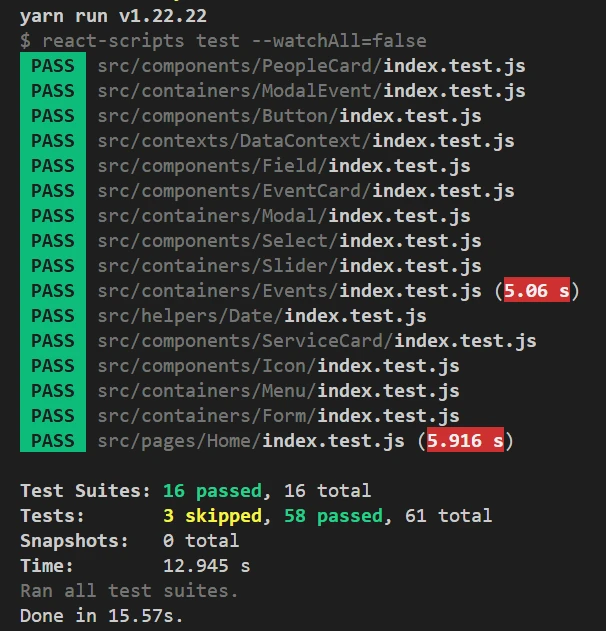

## Contexte

Le site one-page de l'agence 724events avait été abandonné par son développeur, et le directeur marketing avait signalé plusieurs bugs. C'est un scénario fictif, le projet 9 de la formation.

## Objectifs

- Diagnostiquer et corriger les bugs avec les Chrome DevTools et React Developer Tools.
- Rédiger un cahier de recette.

## Stack technique

- React 17, Sass, Git.
- Jest et React Testing Library.
- Chrome DevTools et React Developer Tools.

## Compétences développées

- Débogage méthodique : remonter à la cause plutôt que masquer le symptôme.
- Tests unitaires et d'intégration.
- Recette au format BDD (Given / When / Then).
- Qualité du code : un commit par correction.

## Résultats et impact

- Tests en échec : de 5 à 0. Les 58 tests des 16 suites sont au vert.
- Les 6 bugs relevés sont corrigés, et la console n'affiche plus d'avertissement.
- Le cahier de recette compte 11 scénarios.
- L'évaluateur qualifie le dépôt Git de « qualité pro ». Il relève aussi que j'ai corrigé des anomalies non listées.

_Le résultat de la suite de tests._

## Perspectives d'amélioration

L'évaluateur n'en a formulé aucune. Le scénario suggérait 3 tests unitaires et 3 tests d'intégration supplémentaires ; j'en ai écrit un de chaque. Deux pistes restent ouvertes : compléter cette couverture et ajouter des scénarios négatifs, comme l'envoi d'un formulaire vide.
