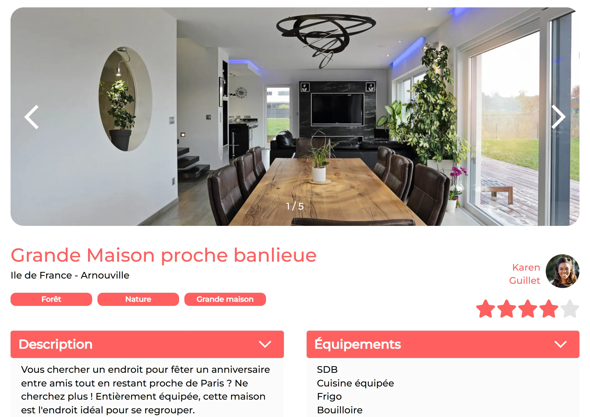

## Contexte

Kasa loue des logements entre particuliers et refond son ancien site. C'est un scénario fictif, le projet 7 de la formation. J'intervenais en freelance sur le front-end, à partir des maquettes Figma et d'un fichier de données.

## Objectifs

- Initialiser l'application avec Vite et configurer la navigation.
- Développer des composants réutilisables.
- Animer l'interface et la styliser en Sass.

## Stack technique

- React 18, React Router, Vite.
- Sass avec CSS Modules.
- Données au format JSON.

## Compétences développées

- Architecture en composants (props, state).
- Routes dynamiques et gestion des erreurs.
- Animations CSS et interface utilisateur responsive.

## Résultats et impact

- Quatre pages. Les fiches des 20 logements sont générées à partir des données : ajouter un logement revient à ajouter une entrée, pas à créer une page.
- Deux composants réutilisables : un menu déroulant, employé sur deux pages, et un carrousel photo.
- Une page d'erreur s'affiche pour les adresses inconnues et les logements inexistants.
- L'application est conforme aux maquettes, sur ordinateur (1440 px) comme sur mobile (375 px).
- Le projet est validé sur les 5 compétences. L'évaluateur souligne un code lisible et maintenable.

_La page d'un logement : le carrousel et les deux menus déroulants ouverts._

## Perspectives d'amélioration

Elles reprennent les axes de l'évaluateur. Depuis la soutenance :

- l'application est en ligne sur GitHub Pages, avec un déploiement automatique à chaque publication ;
- l'accessibilité est renforcée : carrousel navigable au clavier, boutons nommés, changement de photo annoncé aux lecteurs d'écran, menus déroulants reliés à leur contenu.

Reste à factoriser la logique d'état dans des hooks personnalisés.
