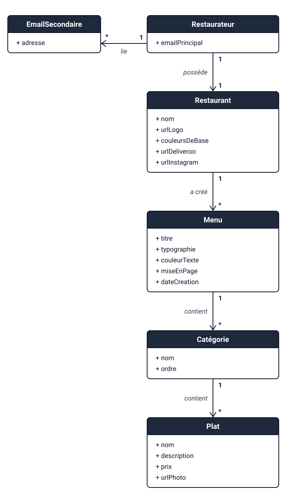
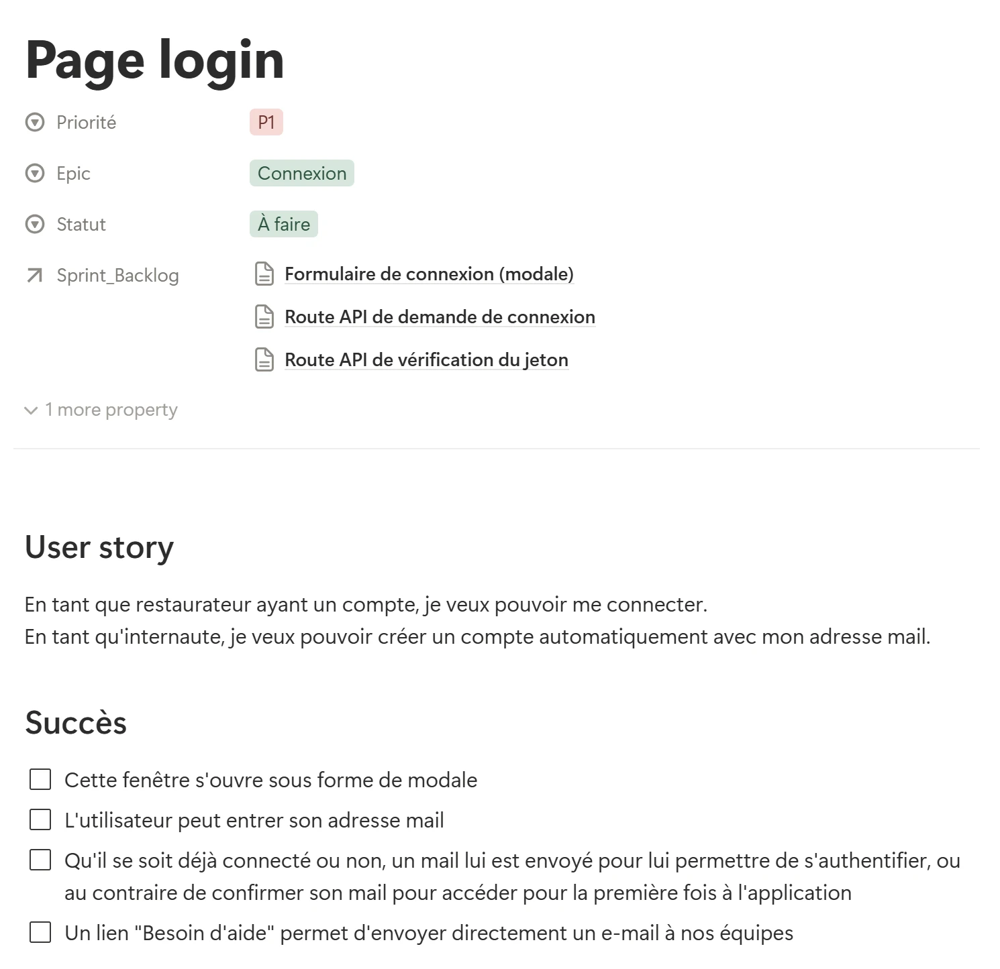

## Contexte

Qwenta, un imprimeur, veut proposer aux restaurateurs un outil web pour créer et diffuser leurs menus sans coder. C'est un scénario fictif, le projet 11 de la formation. Développeur front-end de l'agence Webgencia, j'étais chargé de planifier le développement.

## Objectifs

- Rédiger les spécifications techniques et découper les fonctionnalités en tâches.
- Organiser une veille technologique.
- Suivre le projet dans un tableau Kanban.
- Présenter la solution.

## Stack technique

- Proposée, sans implémentation : React, React Router, CSS natif, Node.js avec Express, PostgreSQL, hébergement Render.
- Pilotage : Notion (Kanban), Figma (maquette), Mermaid (diagrammes).
- Veille technologique : Inoreader.

## Compétences développées

- Analyse du besoin et méthode agile (User Stories, story points).
- Modélisation des données avec un diagramme de classes.
- Veille technologique.
- Vérification des contrastes selon les critères WCAG.

_Le diagramme de classes : du restaurateur jusqu'aux plats._

## Résultats et impact

- Des spécifications de 6 pages, où chaque choix est justifié par deux arguments.
- 16 User Stories découpées en 37 tâches, estimées à 99 story points.
- Un Kanban Notion public.
- Une présentation de 15 slides.
- 7 questions ouvertes consignées, chacune avec son hypothèse de travail.
- Le projet est validé sur les 5 compétences. L'évaluateur salue la présentation et la maîtrise de Scrum.

_Une User Story du Product Backlog, reliée à ses trois tâches techniques du Sprint Backlog._

Pour un client, cette étape garantit que chaque fonctionnalité répond à un besoin validé avant la première ligne de code.

## Perspectives d'amélioration

L'évaluateur note que Scrum reste difficile à appliquer pleinement sur un projet théorique. Je l'applique désormais à un projet réel : ce portfolio, piloté dans un Kanban Notion.
